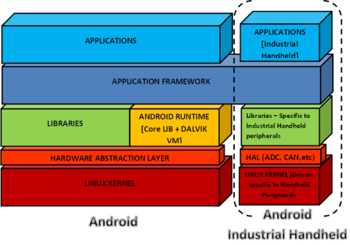

# Bsp
## Bsp = Board support package

In embedded systems, a board support package (BSP) is the layer of software containing hardware-specific drivers and other routines that allow a particular operating system (traditionally a real-time operating system, or RTOS) to function in a particular hardware environment (a computer or CPU card), integrated with the RTOS itself. Third-party hardware developers who wish to support a particular RTOS must create a BSP that allows that RTOS to run on their platform. In most cases the RTOS image and license, the BSP containing it, and the hardware are bundled together by the hardware vendor.

### Schema
<figure>
  
</figure>
