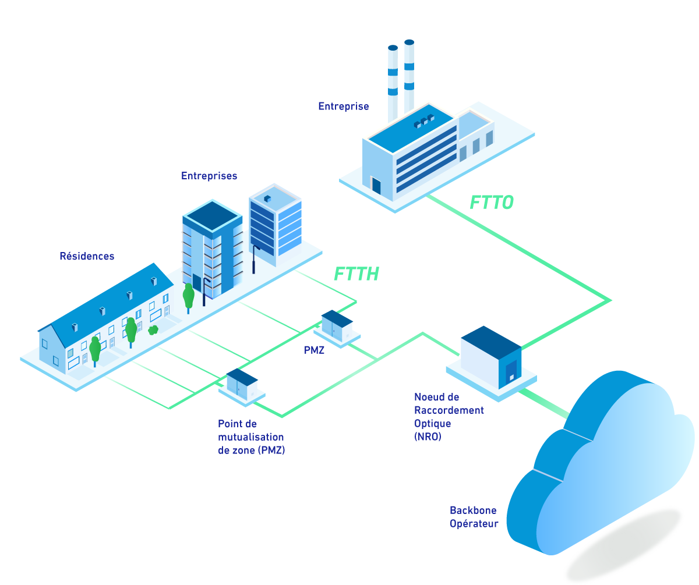
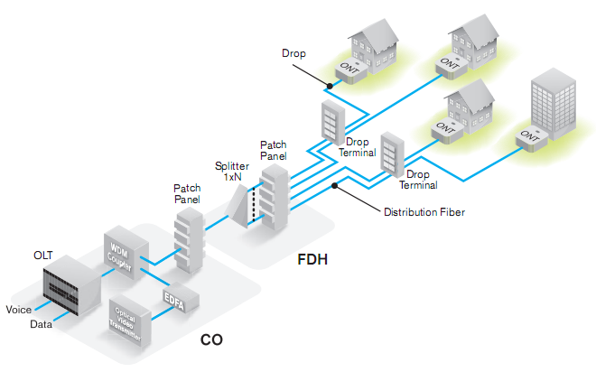

# Ftth
## FTTH = Fiber To The Home
Fiber to the home (FTTH), also called fiber to the premises (FTTP), is the installation and use of optical fiber from a central point directly to individual 

- buildings such as residences, 
- apartment buildings and businesses to provide high-speed internet access. 

FTTH dramatically increases connection speeds available to computer users compared with technologies now used in most places.

### Schema global
<figure>
  
</figure>

### Schema pon
<figure>
  
</figure>

