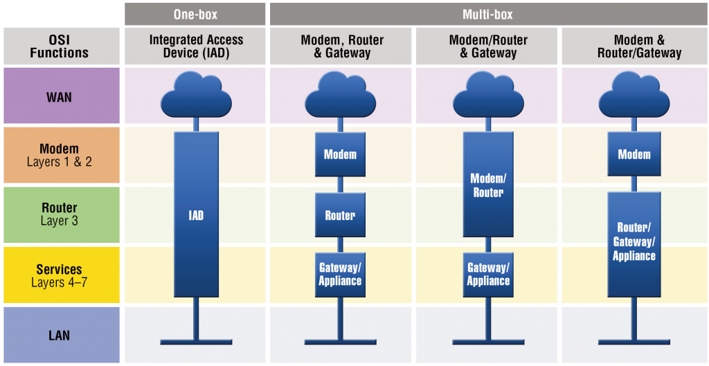

# Iad
## IAD = Integrated Access Device

An Integrated Access Device (or IAD) allows customers to continue using their legacy TDM voice equipment (PBX, Channel Bank, etc...) without the need to invest in new Voice over Internet Protocol (VoIP) capable equipment. 

This also allows customers in locations where legacy TDM services are no longer available to delay expensive equipment upgrades required to move to a pure Voice over IP (VoIP) solution.

### Schema
<figure>
  
</figure>
