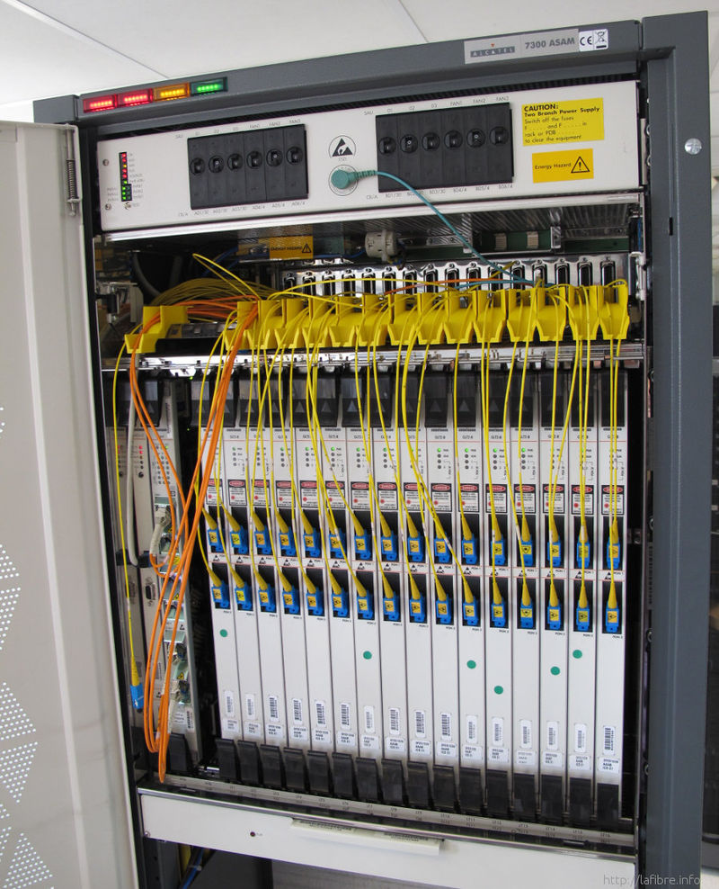

# Olt
## OLT = Optical Line Terminal

OLT is the starting point for the passive optical network, which is connected to a core switch through Ethernet cables. The primary function of the OLT is to convert, frame, and transmit signals for the PON network and to coordinate the optical network terminals multiplexing for the shared upstream transmission. In general, OLT equipment contains rack, CSM (Control and Switch Module), ELM (EPON Link Module, PON card), redundancy protection -48V DC power supply modules or one 110/220V AC power supply module, and fans. In these parts, PON card and power supply support hot-swap while another module is built inside. The OLT has two float directions: upstream (getting distributing different types of data and voice traffic from users) and downstream (getting data, voice, and video traffic from the metro network or from a long-haul network and send it to all ONT modules on the ODN.) The maximum distance supported for transmitting across the ODN is 20 km.

### Look like
<figure>
  
</figure>
