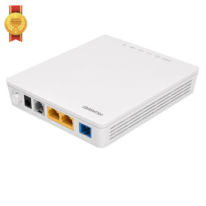

# Ont
## ONT = Optical Network Termination

Optical Network Unit (ONU) / Optical Network Terminal (ONT)
ONU converts optical signals transmitted via fibers to electrical signals. These electrical signals are then sent to individual subscribers. 

In general, there is a distance or other access network between ONU and end user's premises. Furthermore, ONU can send, aggregate, and groom different types of data coming from the customer and send it upstream to the OLT. 

Grooming is the process that optimizes and reorganizes the data stream so it would be delivered more efficiently. OLT supports bandwidth allocation that allows making smooth delivery of data float to the OLT, which usually arrives in bursts from the customer. 

ONU could be connected by various methods and cable types, like twisted-pair copper wire, coaxial cable, optical fiber, or through Wi-Fi.

### Schema
<figure>
  
</figure>

### Photo
<figure>
  
</figure>
