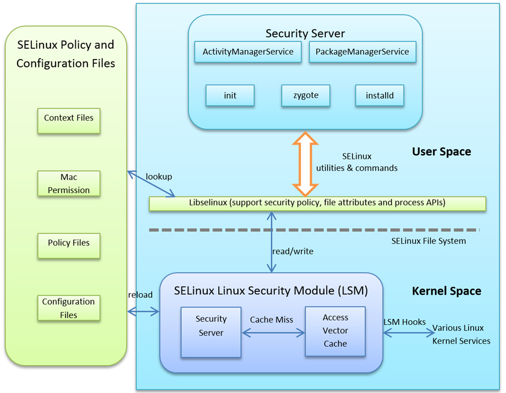

# Selinux
## SElinux = Security-Enhanced Linux 

As part of the Android security model.
Android uses SELinux to enforce mandatory access control (MAC) over all processes.
Even processes running with root/superuser privileges (a.k.a. Linux capabilities).
SELinux enhances Android security by confining privileged processes and automating security policy creation.

### Operation
SELinux operates on the principle of default denial: Anything not explicitly allowed is denied. SELinux can operate in two global modes
- Permissive mode, in which permission denials are logged but not enforced.
- Enforcing mode, in which permissions denials are both logged and enforced.

### Schema
<figure>
  
</figure>

| Version | SElinux |
| ----- | ------ |
| 5.0 | SELinux is fully enforced |
| 6.0 | isolation between users, IOCTL filtering |
| 7.0 | SELinux configuration to further lock down the application sandbox and reduce attack surface | 
| 8.0 | updated SELinux to work with Treble, which separates the lower-level vendor code from the Android system framework |

### Software stack

- **Device hardware** : Android runs on a wide range of hardware configurations including mobile phones, smart TVs, OTT gaming boxes, and set-top-boxes. 
Android is processor-agnostic, but it takes advantage of some hardware-specific security capabilities such as ARM eXecute-Never.

- **Android operating system** : The core operating system is built on top of the Linux kernel. 
All device resources, like camera functions, GPS data, Bluetooth functions, telephony functions, and network connections are accessed through the operating system.

- **Android Application Runtime** : Android apps are most often written in the Java programming language and run in the Android runtime (ART). 
However, many apps, including core Android services and apps, are native apps or include native libraries. 
Both ART and native apps run within the same security environment, contained within the Application Sandbox. 
Apps get a dedicated part of the file system in which they can write private data, including databases and raw files.

### Apps
Android apps extend the core Android operating system. There are two primary sources for apps:

- **Preinstalled apps** : Android includes a set of preinstalled apps including phone, email, calendar, web browser, and contacts. 
These function as user apps and they provide key device capabilities that can be accessed by other apps. 
Preinstalled apps may be part of the open source Android platform, or they may be developed by a device manufacturer for a specific device.
- **User-installed apps** : Android provides an open development environment that supports any third-party app. 
Google Play offers users hundreds of thousands of apps.
