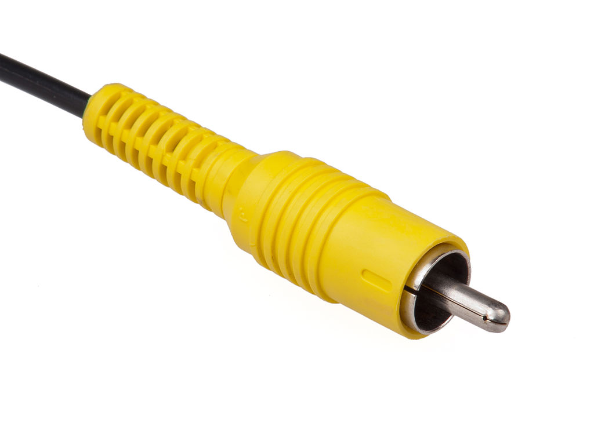

# Spdif
## S/PDIF = Sony/Philips Digital Interface

S/PDIF (Sony/Philips Digital Interface)[1][2] is a type of digital audio interconnect used in consumer audio equipment to output audio over reasonably short distances. The signal is transmitted over either a coaxial cable with RCA connectors or a fiber optic cable with TOSLINK connectors. S/PDIF interconnects components in home theaters and other digital high-fidelity systems.

### Looks like
<figure>
  
</figure>
