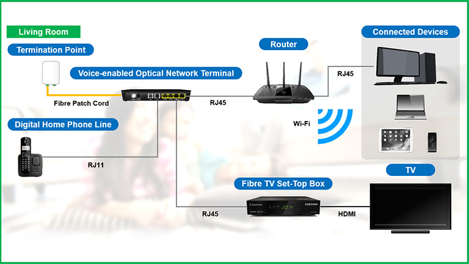

# Stb
## STB = Set Top Box
 A device needed to receive and watch digital television on a ordinary "analog" television. The set-top box receives the digital TV channels from a broadband source (cable, satellite, terrestrial or ADSL). The selected TV program is decoded and translated in a signal that can be understood by an ordinary "analog" television.

In addition to the decoding of tv programs, the set-top box may perform other functions such as recording and playing back television programs and an electronic program guide. The set-top box may also be able to perform interactive functions such as video-on-demand, gaming and other entertainment services if there is a return channel available.

### Look like
<figure>
  
</figure>
