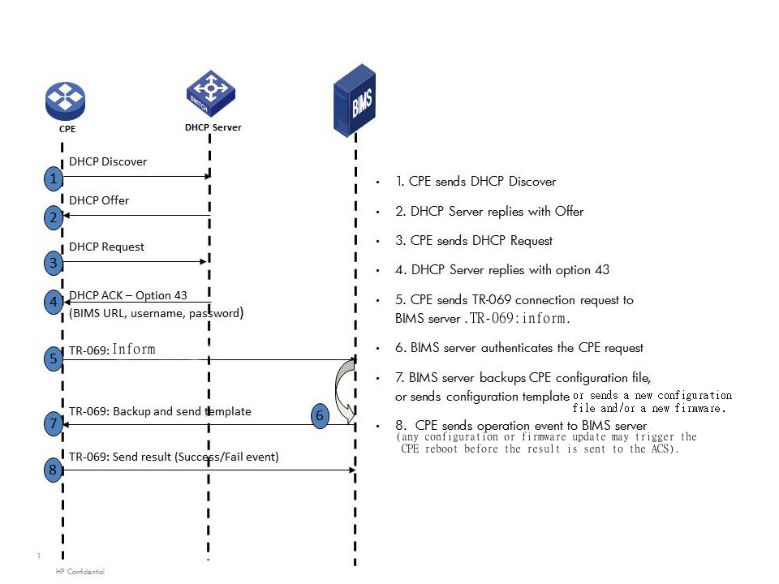

# Tr-069
## Tr-069 = Technical Report069

TR069-client implements CPE WAN Management Protocol (CWMP) for remote device management 
Standardized by the Broadband Forum (BBF). 
CWMP works over IP network using HTTP(S) to communicate with the Auto Configuration Server (ACS)
Can monitor, configure attributes and update the firmware of a remote device.
Typically used by ISPs to manage CPEs, but also can be used for Network Infrastructure Device management.

### Defines 

An application layer protocol for remote management of customer-premises equipment
- Manufacturer
- Product Class
- Serial Number

connected to an Internet Protocol (IP) network. 

TR-069 uses the CPE WAN Management Protocol (CWMP) which provides support functions for auto-configuration, software or firmware image management, software module management, status and performance managements, and diagnostics

### Schema
<figure>
  
</figure>
