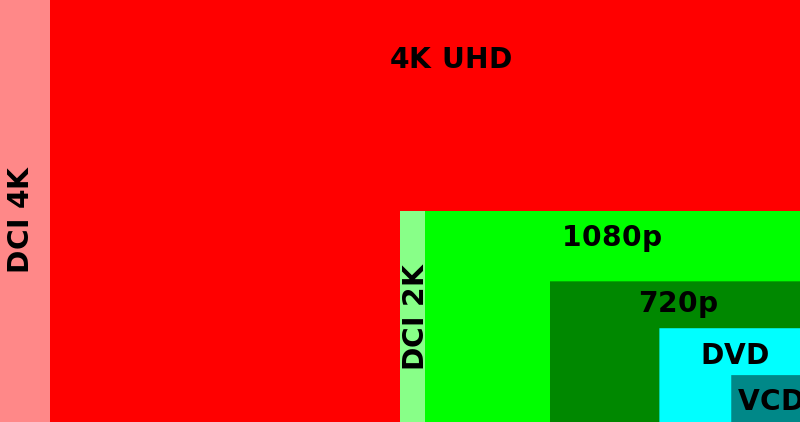

# Uhd
## UHD = Ultra-high-definition

Ultra-high-definition television (also known as Ultra HD television, Ultra HD, UHDTV, UHD and Super Hi-Vision) today includes 4K UHD and 8K UHD, which are two digital video formats with an aspect ratio of 16:9. 

These were first proposed by NHK Science & Technology Research Laboratories and later defined and approved by the International Telecommunication Union (ITU)

It is a digital television (DTV) standard, and the successor to high-definition television (HDTV), which in turn was the successor to standard-definition television (SDTV).

### Schema
<figure>
  
</figure>
